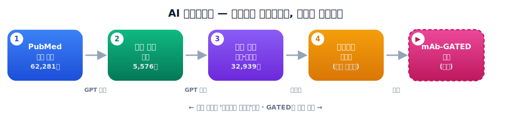
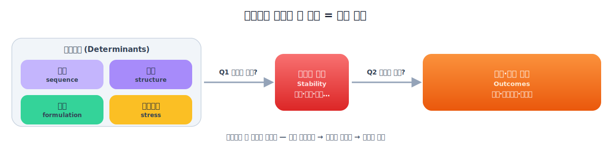
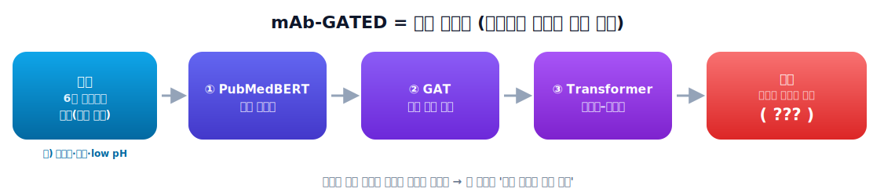

# 📘 교안(강사용) — 생성형 AI로 만드는 mAb 안정성 인과 네트워크
### "PubMed 크롤링 → GPT 추출 → 지식 그래프 → GATED 예측"

---

## 0. 교안 개요

| 항목 | 내용 |
|---|---|
| **주제** | 생성형 AI(LLM) + 그래프 신경망으로 항체 의약품 안정성 지식을 자동 구축·예측 |
| **대상** | 학부 고학년 ~ 대학원 초년 / AI·바이오·제약 융합 전공, 코딩 입문 경험자 |
| **선수지식** | Python 기초, 함수/딕셔너리 개념. (딥러닝·생물 지식은 강의 중 보충) |
| **총 차시** | 3차시 × 50분 (또는 2.5시간 집중형 1회). 실습 비중 약 40% |
| **준비물** | 노트북, 인터넷, Google 계정(Colab), (선택) OpenAI API 키 |
| **결과물** | 학생 각자가 만든 **인과 네트워크 그래프 PNG** + (선택) 웹 업로드 |
| **원자료** | docx 논문(mAb_GATED_v2), step1~4 노트북, GitHub 레포·웹페이지 |

### 학습 목표 (이 수업이 끝나면 학생은…)
1. **[지식]** IV→SC 전환이 촉발한 mAb 안정성 연구의 **두 가지 질문**(무엇이 안정성에 영향을 주나 / 안정성은 무엇에 영향을 주나)과, 이를 잇는 **결정요인 → 안정성 지표 → 임상결과** 인과사슬을 설명할 수 있다.
2. **[지식]** "개별 연구는 고립적이고 전체 종합이 없다"는 **문제의식**과, 그에 대한 해법(지식그래프+예측모델)이 풀려는 질문("어떤 인과 주장이 반복 지지되나/가설인가/공백인가, 그리고 학습 가능한가")을 말할 수 있다.
3. **[지식]** 4단계 파이프라인(수집→필터→추출→예측)의 각 단계 입력·처리·출력을 말할 수 있다.
4. **[기능]** PubMed API로 논문을 수집하고, GPT로 (원인→관계→결과)를 추출하는 코드를 실행할 수 있다.
5. **[기능]** 엣지 표를 **네트워크 그래프로 시각화**하고, 색·크기·방향성을 결정요인→안정성→결과 흐름으로 해석할 수 있다.
6. **[이해]** GATED 모델이 푸는 "마스킹된 노드 예측" 과제와 평가지표(MRR, Hits@1), 그리고 베이스라인(빈도·DistMult) 대비의 의미를 개념적으로 이해한다.

> **범위 경계(중요):** 학생 **실습은 STEP 1→그래프까지**. **GATED 학습(STEP 4)은 개념 설명만** 합니다.
> (이유: GPU·사설 DB·장시간 학습이 필요해 수업 실습엔 부적합. 단, 결과·구조·의미는 충분히 다룸.)

---

## 1. 차시 구성 (한눈에)

| 차시 | 구간 | 내용 | 시간 | 형태 |
|---|---|---|---|---|
| **1차시** | 도입 | 동기부여: 항체약·IV→SC·안정성 문제 | 10분 | 강의 |
| | 개념 | 전체 파이프라인 조망 + 지식 그래프란 | 15분 | 강의 |
| | STEP 1 | PubMed 크롤링 개념 + 실습 | 20분 | 실습 |
| | 정리 | Q&A | 5분 | 토론 |
| **2차시** | STEP 2 | GPT 관련성 필터 개념 + 실습 | 15분 | 실습 |
| | STEP 3 | 인과관계 추출·표준화·집계(⭐핵심) | 25분 | 실습 |
| | 정리 | "내 엣지표" 확인 | 10분 | 토론 |
| **3차시** | 🎨 그래프 | 시각화 실습 + 해석(허브·관계분포·ego) | 20분 | 실습 |
| | STEP 4 | GATED 모델 개념·구조·결과 | 20분 | 강의 |
| | 마무리 | 도전과제·평가 안내·전체 회고 | 10분 | 토론 |

---

## 2. 도입부 강의 노트 (1차시 · 25분)

> **강의 뼈대:** 도입부는 논문 초록의 구조 그대로 **배경(Background) → 문제(Problem) → 목표(Objective)** 순으로 전개한다.

### 2-1. 후킹 질문으로 시작
> "병원에서 몇 시간씩 맞던 항암 주사를, 집에서 펜으로 3초 만에 맞을 수 있다면?
> 그걸 막는 가장 큰 적이 바로 **단백질이 서로 들러붙는 현상(응집)** 입니다."

### 2-2. 배경(Background) — 칠판 5줄 + '두 가지 질문'
1. **mAb(단일클론항체)** = 표적에 딱 붙는 큰 단백질 약(항암·자가면역).
2. **IV→SC 전환**(정맥→피하)이 지난 **40년** 안정성 연구를 촉발 — SC는 **고농도** 필요 → 불안정 폭증.
3. 그 결과 안정성을 둘러싼 **두 가지 질문**이 나란히 쌓임:
   - **Q1 (앞):** *무엇이* 안정성을 좌우하나? → **결정요인**: 제형조건(pH·이온세기·부형제), 분자특성(pI·소수성), 공정변수
   - **Q2 (뒤):** 안정성은 *무엇을* 좌우하나? → **결과**: 효능, 면역원성, 약동학(PK), 제조성
4. 두 질문을 이으면 **3층 인과사슬**: `결정요인(determinants) → 안정성 지표(stability) → 임상·품질 결과(outcomes)`.
5. 이 양방향 관계들이 모여 **복잡하게 얽힌 네트워크**를 이룬다 → 그래서 "그래프"가 필요.

> 📌 판서 팁: 칠판 한가운데 `결정요인 → 안정성 → 결과` 가로 화살표를 그려두고, 수업 내내 각 STEP·각 그래프를 이 사슬 위에 얹어 설명하면 학생이 흐름을 놓치지 않는다. (그래프 색도 왼쪽 결정요인→가운데 안정성→오른쪽 결과로 흐름)

### 2-2b. 문제(Problem)와 목표(Objective) — 칠판 요약
**문제:** 40년 증거가 쌓였는데도…
- 개별 논문은 **한두 인과 고리**만 고립적으로 다룸
- 흩어진 **가설 + 검증된 관계**를 **하나의 네트워크로 종합**한 적 없음
- 그래서 *"어떤 주장이 반복 지지되나? 어떤 건 가설인가? 근거 공백은 어디인가?"* 를 물을 **틀**이 없음
- 이 패턴이 **AI로 학습 가능한지** 검증한 **예측 모델**도 없음

**목표(우리가 만든 3가지):**
- **① 채굴** — 40년 논문에서 (원인→관계→결과)를 생성형 AI로 추출·표준화 (Q1·Q2 모두)
- **② 지도** — **34개 표준 안정성 지표**를 중심으로 한 **탐색 가능한 인과 지식그래프(KG)** 구축
- **③ 학습** — **mAb-GATED** 로 "문헌 패턴이 학습 가능한가?" 검증 (빈도·DistMult 베이스라인과 비교)

> 🎯 학생 실습 = ①② (그래프까지). ③(GATED)은 개념 설명.

### 2-3. 강사용 배경(깊이 보강)
- **물리적 분해**: 응집(aggregation), 점도(viscosity), 입자형성. *원인*: 소수성 패치 노출, 고농도, 진탕.
- **화학적 분해**: 메티오닌 산화, 아스파라긴 탈아미드화, 아스파르트산 이성질화 → 결합력↓, 면역원성↑.
- IV→SC 핵심 수치: SC 주사량 **≤2 mL**, 용량은 수백 mg → **≥120 mg/mL** 고농도 불가피. 100 mg/mL 넘으면 점도가 수십 cP로 치솟아 펜으로 주입 곤란.
- **POC 분자**: belimumab(Benlysta) — IV·SC 둘 다 FDA 승인되어 모델 검증의 정답지로 사용.

### 2-4. 자주 나오는 질문(FAQ)
- *"왜 사람이 직접 읽지 않고 AI로?"* → 62,281편을 사람이 읽으면 수개월. GPT는 ~8시간. **규모**가 핵심.
- *"AI가 추출한 게 틀리면?"* → 그래서 STEP 2에 한 줄 근거를 저장하고, 별도 **전문가 검수(HITL)** 단계를 둠.
- *"인과(causal)라며 상관(correlation)도 섞이지 않나?"* → 여기서 '인과'는 **저자가 직접 방향성으로 서술한 관계**를 뜻함(통계적 개입효과가 아님). 이 구분을 학생에게 명확히.

---

## 3. 파이프라인 조망 (1차시 · 15분)



### 3-1. 전체 그림 (판서용)
```
STEP1 수집      STEP2 필터       STEP3 추출/정규화/집계        시각화 + STEP4 예측
PubMed  ─→  62,281편 ─→ 5,576편(9%) ─→ 39,792 관계 → 32,939 엣지 ─→ D3 그래프
 (126쿼리)    (GPT 관련성)   (관련만)      (GPT 삼중항)    (표준화·집계)        └→ mAb-GATED (MRR 0.88)
                                                                          모두 MySQL(abswitch) 경유
```

### 3-2. 단계별 입력/출력 표 (논문 Table 1)
| Step | 노트북 | 입력 | 출력 |
|---|---|---|---|
| 1 | step1_crawl | PubMed API(126쿼리, 1980–2026) | `mab_pubmed_abstracts` (62,281편) |
| 2 | step2_filter | 62,281편 | `mab_pubmed_filtered2` (5,576 관련) |
| 3 | step3_extract | 5,576편 | `mab_causal_edges_summary2` (32,939 엣지) |
| 4 | step4_gated | 32,939 엣지 | 학습된 mAb-GATED (MRR 0.92) |
| — | index.html | 32,939 엣지 | D3.js 인터랙티브 그래프(GitHub Pages) |

### 3-3. "지식 그래프(KG)"란? (꼭 짚기)
- **노드(node)** = 개념(예: aggregation, sucrose), **엣지(edge)** = 방향성 관계(예: ─promotes→).
- 표(테이블)와 달리, 그래프는 **간접 경로**(A→B→C, "원인의 원인")를 표현·학습할 수 있음. → STEP 4의 강점.

### 3-4. 6 카테고리 = 3층 인과사슬 (그래프 읽기의 핵심)


6개 노드 카테고리를 도입부의 사슬에 그대로 포개면, 그래프가 **왼→오** 로 읽힌다.
```
[결정요인 Determinants]            [안정성 지표]          [임상·품질 결과]
 sequence 🟪  structure 🟣          stability 🔴            quality_outcome 🟠
 formulation 🟢  stress 🟡          (34개 표준 지표)        (면역원성·효능·PK…)
        └──── Q1: 무엇이 영향? ────┘  └──── Q2: 무엇에 영향? ────┘
```
- 안정성 지표는 이 KG의 **중심축(34개 표준 지표)**. 결정요인이 들어오고(Q1), 결과로 나간다(Q2).
- 학생에게: "빨강(안정성) 노드를 기준으로 **왼쪽에서 들어오는 화살표 = 원인(Q1)**, **오른쪽으로 나가는 화살표 = 결과(Q2)**" 라고 각인.

---

## 4. STEP별 실습 운영 가이드

> 실습 노트북: `notebooks/01_실습_파이프라인.ipynb` (수집→필터→추출→그래프 한 번에)
> 그래프 전용: `notebooks/02_그래프_그리기.ipynb` (API 불필요, 공개데이터로 4종 그래프)

### 🔹 STEP 1 — PubMed 크롤링 (실습 20분)
**개념 포인트**
- E-utilities API: `esearch`(검색→PMID 목록) → `efetch`(PMID→제목/초록/연도).
- **인과사슬 기반 쿼리 설계**가 핵심: 단순 키워드가 아니라 7갈래(서열→구조→제형·스트레스→안정성→품질→PK/PD)로 길목을 망라.
- 예의(rate limit): 요청 사이 `time.sleep(0.4)`. 1만 건 초과 시 `retstart` 페이징.

**운영 팁**
- 실습은 **검색어 2개, 쿼리당 40편** 정도로 작게(수업 시간·서버 예의). "원본은 126쿼리·6만편"임을 대비시켜 **규모 감각** 심기.
- 흔한 오류: 초록 없는 논문 → `len(abstract)>50` 필터로 거름(코드에 포함).

**판서 한 줄:** *"검색은 그물, 쿼리 설계는 그물코의 촘촘함."*

### 🔹 STEP 2 — GPT 관련성 필터 (실습 15분)
**개념 포인트**
- 검색은 **재현율(빠짐없이)** 우선 → 잡음 포함. 필터는 **정밀도(정확히)** 를 회복.
- GPT에 제목+초록 → `{relevant: true/false, reason: "..."}`. **근거 한 줄 저장**이 신뢰성·재현성의 핵심.
- 결과: 9.0% 통과(5,576편). GPT-4o-mini(v1)는 12.1% 통과했는데, **gpt-5-mini(v2)가 더 엄격**해 시약용 항체 논문 등을 더 잘 걸러냄.

**운영 팁**
- **키 없는 학생 대응**: 노트북은 키가 없으면 자동으로 필터를 건너뛰고 전체를 통과시킴 → 실습 흐름이 끊기지 않음.
- 비용 안심시키기: gpt-4o-mini로 수십 편 = **수십 원** 수준.

### 🔹 STEP 3 — 인과관계 추출·표준화·집계 (실습 25분, ⭐최중요)
**개념 포인트 (3-Stage)**
- **2a 추출**: 초록 → `(cause, category_cause, effect, category_effect, relationship, confidence, evidence)` 삼중항.
  - 6 노드 카테고리 / 22 관계 유형. *"thermal stress promotes aggregation"* → `(thermal stress)─promotes→(aggregation)`.
  - **정책 규칙**도 설명: increases는 '나쁜 게 증가'에만, mediation 체인은 A→C, C→B 둘 다 추출 등.
- **2b 표준화**: 같은 뜻 다른 표현을 **표준 용어**로 통일(예: aggregate formation→aggregation). 원시 약 2.9만 표현 → 1.6만/1.2만으로 축소.
- **2c 집계**: (cause, effect, relation)별 **빈도·논문수** 계산 → 32,939 고유 엣지. **관계 차원을 키에 포함**(반대 극성 관계가 병합되지 않도록!).

**운영 팁**
- 실습은 **앞 20편만** 추출(비용·시간). 표준화는 "소문자/공백 정리"로 단순화하고, "원본은 GPT가 표준화"임을 설명.
- 학생이 만든 `step3_edges.csv` 를 열어 **직접 만든 데이터**라는 성취감 부여.
- **per-article 관계 수**: gpt-5-mini는 평균 7.7개(gpt-4o-mini 2.7개의 ~2.9배) → "모델 성능이 데이터 밀도를 바꾼다" 토론 소재.

**판서 한 줄:** *"이 엣지표 한 장이 그래프의 재료이자 모델의 교과서."*

### 🔹 시각화 — 네트워크 그래프 (실습 20분, 🎯결승선)
**해석 3원칙(반드시 학생이 말로 설명하게):**
1. **노드 색 = 6 카테고리** (아래 색표)
2. **노드 크기 = 총 등장 빈도**(중요 길목)
3. **화살표 색 = 방향성**: 🟢초록=안정화/억제, 🔴빨강=불안정/촉진, ⚪회색=중립

**색표 (D3 index.html과 동일 — 학생 배포용)**
| 카테고리 | 색(HEX) | | 방향성 | 색(HEX) |
|---|---|---|---|---|
| sequence | `#c4b5fd` | | Positive(stabilizes/inhibits/prevents/decreases/shields) | `#22c55e` |
| structure | `#a78bfa` | | Negative(promotes/induces/increases/destabilizes/oxidizes…) | `#ef4444` |
| formulation | `#34d399` | | Neutral(correlates/modifies/binds/requires) | `#94a3b8` |
| stress | `#fbbf24` | | | |
| stability | `#f87171` | | | |
| quality_outcome | `#fb923c` | | | |

**3종 해석 포인트 (이미지: `images/` 폴더 참고)**
- **허브 Top**: aggregation·immunogenicity·binding activity → "문제의 길목". (논문 Table 4: in-degree 기준 binding activity 1위)
- **관계 분포**: modifies·correlates·decreases 상위 → 문헌은 **단정보다 수식/상관** 표현이 많음.
- **ego(aggregation)**: 빨강 다수가 응집을 촉진, 초록(EDTA 등)이 억제, 응집→면역원성으로 전파.

**확장 활동:** 살아있는 웹(https://starg-lee.github.io/mab-causal-network-v2/)에 학생 CSV 업로드 → 마우스로 탐색.

---

## 5. STEP 4 — GATED 모델 (3차시 · 강의 20분, 개념)

### 5-1. 한 문장 정의
> **"그래프에서 안정성 노드 하나를 가린 뒤, 주변 이웃(원인 조건)을 보고 가려진 노드를 맞히는 빈칸채우기 모델."**

### 5-2. 입력 구조 (판서)
```
TARGET : 가려진 정답 안정성 노드 (예: aggregation)
INPUT  : 6개 카테고리 × 각 K=5개 이웃 = 30개 토큰
         각 토큰 = [노드ID, 카테고리, 관계, 방향(1-hop직접/2-hop간접)]
         빈도 높은 관계일수록 자주 샘플링(중요도 반영)
```

### 5-3. 4단계 아키텍처 (그림 흐름)


```
임베딩(노드+카테고리+관계+방향)            ← node_emb은 PubMedBERT로 의미 초기화
   ↓ GAT (그래프 어텐션, 이웃 정보 집약)
   ↓ Transformer Encoder (토큰 상호 self-attention)
   ↓ Mean Pooling (문맥 벡터 D=128)
   ↓ Transformer Decoder (정답 노드 생성)
   ↓ Constrained Output (물리/화학/생물 풀 안에서만 선택)
```
- **PubMedBERT** = 생의학 문장으로 학습된 언어모델. *역할*: 노드 이름의 **의미**를 768차원 벡터로 초기화(학습 중엔 갱신, BERT 자체는 고정).
  - 검증: conformational↔thermal stability 0.914, sucrose↔trehalose 0.897 (의미 가까운 단어가 가까이서 출발).
- **GAT** = Graph Attention Network(Veličković, 2018). 이웃마다 중요도(attention)를 다르게 줘 정보 집약.
- 파라미터 약 **3.21M**, 320만 규모의 작은 모델.

### 5-4. 평가지표 (꼭 직관으로)
- **Hits@1** = 정답을 **1등**으로 맞힌 비율. **Hits@3** = 정답이 **top-3** 안에 든 비율.
- **MRR**(Mean Reciprocal Rank) = 정답 순위의 역수 평균(1등=1.0, 2등=0.5…). 높을수록 좋음.
- **제약 평가(constrained)**: 정답과 **같은 하위범주(물리/화학/생물) 안에서만** 순위 매김 → 공정한 난이도.

### 5-5. 결과 (논문 Table 5·6)
| 모델 | MRR | Hits@1 | 메모 |
|---|---|---|---|
| Random | 0.277 | 8.6% | 기준점 |
| Frequency | 0.557 | 36.6% | 빈도 찍기 |
| DistMult | 0.340 | 16.8% | 단순 임베딩 그래프 |
| **mAb-GATED(전체)** | **0.921** | **89.7%** | ✅ |
| mAb-GATED(테스트셋) | 0.884 | 84.6% | 보수적 수치 |

- 하위범주별 테스트: **화학 98.97%**(거의 포화), 물리 87.9%, 생물 65.8%.
- v1(gpt-4o-mini)→v2(gpt-5-mini): 테스트 MRR 동일(0.884)인데 **Hits@1 +7.46%p** → 1등 변별력↑. (대신 후보 풀이 넓어져 Hits@3는 하락.)

### 5-6. 의미·전망
- **국제 인정**: v1 파이프라인이 **ISMB 2026**(BOKR 트랙) 채택.
- 화학 안정성 99% 예측은 **실무 활용 가능** 수준(산화·탈아미드·단편화가 핵심 분해경로).
- 장기 목표: 서열·구조·제형·안정성을 통합한 **Antibody Drug Foundation Model**.

---

## 6. 평가·과제

### 형성평가(수업 중, 구두/퀴즈)
- "엣지에서 화살표 색이 빨강이면 무슨 뜻?" / "허브 노드가 크다는 건 무슨 의미?"
- "STEP 2 필터가 없으면 그래프에 어떤 문제가 생길까?"

### 과제 (택1~2)
1. **나만의 그래프**: STEP 1 검색어를 바꿔(예: `oxidation`, `freeze-thaw`) 자신만의 엣지표·그래프 PNG 제출 + 3줄 해석.
2. **허브 분석**: 공개 데이터로 ego network 3종(예: viscosity, immunogenicity, oxidation)을 그려 비교·서술.
3. **개념 서술**: "GATED의 빈칸채우기 과제"를 비전공자에게 설명하는 한 단락(+ MRR/Hits@1 정의) 작성.

### 평가 루브릭(예시, 100점)
| 항목 | 배점 | 기준 |
|---|---|---|
| 파이프라인 실행 | 30 | 수집→그래프까지 오류 없이 산출물 제출 |
| 그래프 해석 | 30 | 색/크기/방향성 3원칙으로 정확히 해석 |
| 개념 이해(GATED·지표) | 25 | 마스킹 과제·MRR/Hits 직관 설명 |
| 확장·창의성 | 15 | 검색어 변형/추가 분석/웹 업로드 등 |

---

## 7. 토론 질문 (생각 키우기)
1. **데이터 vs 모델**: gpt-5-mini가 논문당 관계를 2.9배 더 뽑아 그래프가 2배 조밀해졌다. "더 많은 관계 = 더 좋은 지도"일까? 잡음 위험은?
2. **인과의 정의**: 여기서 '인과'는 저자 서술 기반이다. 통계적 인과(개입효과)와 어떻게 다르고, 어떤 오해를 부를 수 있나?
3. **편향**: 많이 연구된 주제(응집)는 허브가 되고, 덜 연구된 주제는 작아진다. 이 그래프는 "현실"인가 "연구 관심사의 거울"인가?
4. **검수의 가치**: 정확도 84.6%인 모델을 실제 제약 현장에서 믿고 쓰려면 무엇이 더 필요할까?(HITL)
5. **일반화**: belimumab 하나로 검증한 모델을 모든 항체에 써도 될까?
6. **반복 지지 vs 가설 vs 공백**(문제의식 핵심): 엣지의 `frequency`·`num_papers`가 높으면 "반복 지지된 주장"에 가깝다. 그렇다면 빈도가 낮은 엣지는 *아직 가설*일까, 아니면 *중요한데 덜 연구된 근거 공백*일까? 둘을 어떻게 구별할 수 있을까?
7. **양방향성**: 같은 노드(예: aggregation)가 어디서는 원인(Q1), 어디서는 결과(Q2)다. 이 양방향성이 IV→SC 전환 의사결정에 왜 중요한가?

---

## 8. 부록

### 8-A. 핵심 수치 카드 (배포용)
- 수집 **62,281편** → 관련 **5,576편(9.0%)** → 원시 관계 **39,792** → 고유 엣지 **32,939**
- 노드 카테고리 **6**(결정요인 4: 서열·구조·제형·스트레스 / 안정성 1 / 결과 1) · 관계 유형 **22**
- 표준 안정성 지표 **34**(물리·화학·생물 3개 하위범주) — KG·GATED의 중심축
- 허브 Top3: **aggregation · immunogenicity · binding activity**
- GATED: 파라미터 **3.21M**, 테스트 **MRR 0.884 / Hits@1 84.6%**, 화학 **99%**
- 공개 CSV(빈도≥2): **2,436 엣지 / 약 960 노드** (수업 그래프용)

### 8-B. 용어집 (학생용 미니 사전)
| 용어 | 쉬운 설명 |
|---|---|
| mAb | 표적에 붙는 큰 단백질 약(단일클론항체) |
| aggregation | 단백질이 들러붙어 덩어리짐(가장 큰 불안정 문제) |
| IV/SC | 정맥주사 / 피하주사 |
| 노드/엣지 | 그래프의 점 / 점을 잇는 방향 화살표 |
| 지식 그래프(KG) | 개념들을 관계로 연결한 지도 |
| LLM/GPT | 대규모 언어모델(글을 읽고 쓰는 AI) |
| PubMedBERT | 의학 문장으로 학습된 언어모델(의미 초기화에 사용) |
| GAT | 그래프 어텐션 신경망(이웃 정보 가중 집약) |
| Transformer | self-attention 기반 신경망(문맥 종합) |
| MRR/Hits@1 | 정답 순위 품질 지표(높을수록 좋음) |

### 8-C. 사전 점검(강사 체크리스트)
- [ ] Colab 접속·런타임 확인, 인터넷 방화벽(PubMed/GitHub raw 접근) 점검
- [ ] (선택) 공용 OpenAI 키 준비 또는 "키 없이도 됨" 안내
- [ ] `images/` 예시 그래프 미리 열어 해석 시연 준비
- [ ] 비용/윤리 안내(API 비용, 데이터 출처, 인과≠통계인과)

### 8-D. 자료 출처
- 논문: `mAb_GATED_v2.docx` (Lee et al., *Briefings in Bioinformatics* 투고, v2)
- 원본 노트북: `step1_pubmed_crawling`, `step2_relevance_filtering`, `step3_extract_finish`, `step4_mab_gated_colab`
- 코드·데이터: https://github.com/STARG-LEE/mab-causal-network-v2
- 인터랙티브 그래프: https://starg-lee.github.io/mab-causal-network-v2/
- 리뷰 앱: https://github.com/STARG-LEE/mab-review-app
