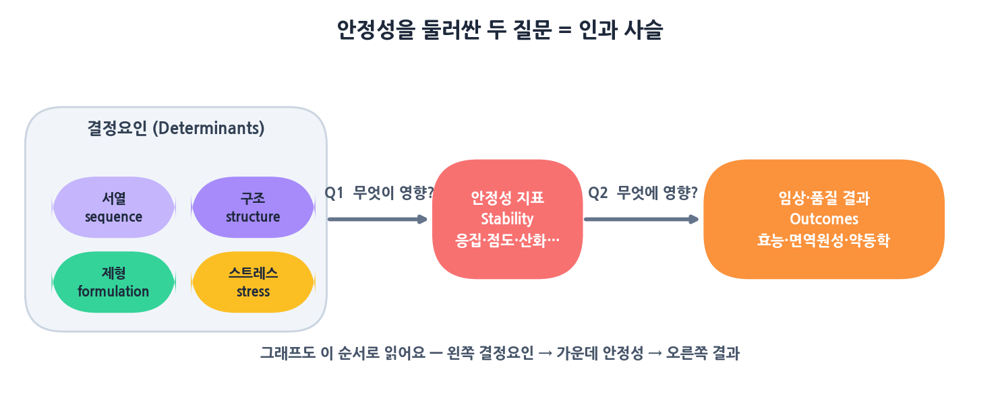
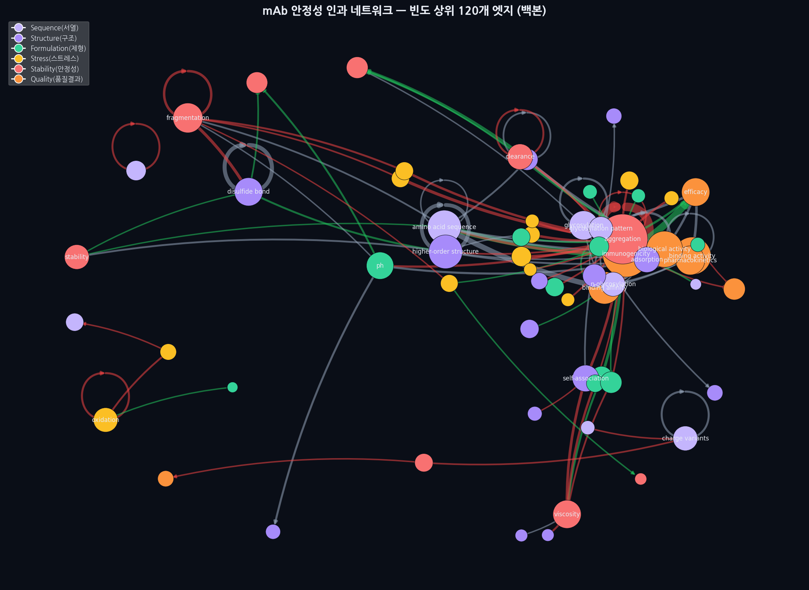
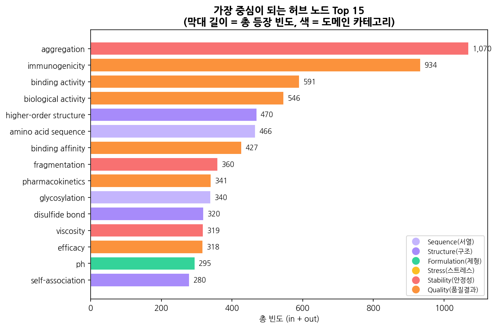
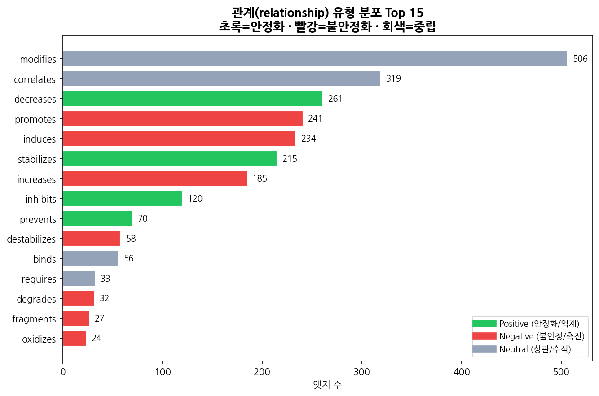
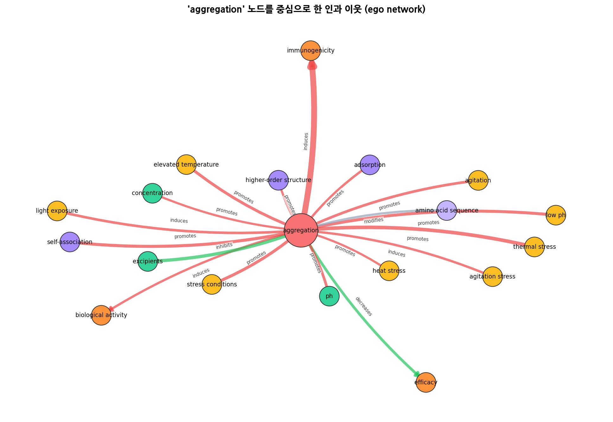
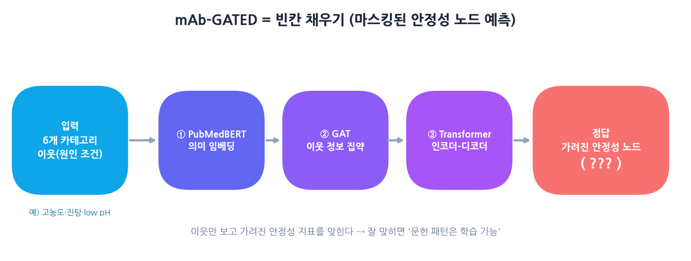

# 🧬 쉽게 읽는 mAb-GATED 이야기
### "40년간의 논문을 AI가 읽고, 안정성의 인과 지도를 그리다"

> 이 글은 **배경지식이 없어도** 끝까지 읽을 수 있게 쓴 버전입니다.
> 흐름은 연구의 뼈대 그대로 **배경(Background) → 문제(Problem) → 목표(Objective)** 순서로 갑니다. 편하게 읽어 주세요. ☕

---

## ① 배경 (Background) — 왜 이 연구가 시작됐나

### 항체 의약품(mAb)이란?
**항체(antibody)** 는 우리 몸이 외부 침입자에 딱 달라붙어 무력화하려고 만드는 단백질입니다.
과학자들이 이걸 공장에서 똑같이 만들어 **항암·자가면역 치료제**로 쓰는데, 이를 **단일클론항체(monoclonal antibody, mAb)** 라고 불러요.

### 지난 40년의 화두 — IV에서 SC로
지금까지 많은 항체약은 **정맥주사(IV)** — 병원에서 30분~몇 시간 맞아야 했습니다.
이걸 **피하주사(SC)** — 집에서 펜으로 톡 — 으로 바꾸면 환자가 훨씬 편해지죠.
그런데 SC로 바꾸려면 약을 **아주 진하게(고농도)** 농축해야 하고, 그러면 단백질이 **불안정**해집니다(응집·점도 상승 등).

그래서 **지난 40년간** 전 세계가 "mAb 안정성"을 집중 연구했고, 그 결과 **두 가지 질문**이 나란히 쌓여 왔습니다.

### 🔑 핵심: 안정성을 둘러싼 두 가지 질문
| | 질문 | 무엇을 묻나 | 예시 |
|---|---|---|---|
| **Q1 (앞)** | **무엇이** 안정성에 영향을 주나? | 안정성의 **결정요인** | 제형 조건(pH·이온세기·부형제), 분자 특성(pI·소수성), 공정 변수 |
| **Q2 (뒤)** | 안정성은 **무엇에** 영향을 주나? | 안정성의 **결과** | 효능, 면역원성, 약동학(PK), 제조성 |

이 두 방향을 이으면 하나의 **인과 사슬**이 됩니다 👇

```
   [결정요인]          →     [안정성 지표]      →      [임상·품질 결과]
 Determinants               Stability                  Outcomes
 pH, 부형제, 열,            응집, 점도,                효능, 면역원성,
 서열, 구조 …               산화, 단편화 …             약동학, 제조성 …
        └──── "무엇이 영향을 주나?" Q1 ──┘   └──── "무엇에 영향을 주나?" Q2 ──┘
```

> 놀랍게도 이 3층 구조는 나중에 그래프의 **색**과 정확히 맞아떨어집니다.
> 왼쪽(결정요인) → 가운데(안정성) → 오른쪽(결과). 뒤에서 다시 봅니다.



---

## ② 문제 (Problem) — 40년 자료가 쌓였는데도 왜 부족한가

증거는 산더미인데, 정작 **전체 그림**이 없습니다.

- 🔹 개별 논문은 보통 **한두 개의 인과 고리**만 따로 다룹니다. (응집은 응집대로, 점도는 점도대로)
- 🔹 흩어진 **가설들과 검증된 관계들**을 **하나의 네트워크로 종합**한 시도가 없습니다.
- 🔹 그래서 이런 질문에 답할 **틀**이 없습니다:
  > *"어떤 인과 주장이 **반복적으로 지지**되나? 어떤 건 아직 **가설**인가? **근거 공백**은 어디인가?"*
- 🔹 게다가, 문헌에서 뽑은 이 패턴이 **AI로 학습 가능한지** 검증한 **예측 모델**도 없었습니다.

> 한마디로: **"지식은 많은데 지도가 없다."** 그래서 지도를 만들고, 그 지도가 학습 가능한지까지 확인하자 — 이게 이 연구입니다.

---

## ③ 목표 (Objective) — 우리가 만든 것 세 가지

```
①  채굴(Mine)      40년 PubMed 논문에서 (원인→관계→결과)를 생성형 AI로 추출·표준화.
                   "무엇이 안정성에 영향을 주나"와 "안정성이 무엇에 영향을 주나"를 모두 포착.
                          ↓
②  지도(Graph)     이 관계들을 34개 표준 안정성 지표를 중심으로 한
                   '탐색 가능한 인과 지식 그래프(KG)'로 조직화.
                          ↓
③  학습(Learn)     mAb-GATED 모델로 "문헌에서 나온 인과 패턴이 정말 학습 가능한가?"를 검증.
                   빈도 기반·DistMult 같은 단순 기법들과 성능을 비교.
```

우리가 **직접 실습**하는 건 ①②(채굴→지도) — 즉 **그래프를 그리는 데까지**입니다.
③(GATED)은 "이런 게 있다"는 **개념**으로 이해하면 됩니다. 🎯

---

## ④ 어떻게 만드나 — 4단계 파이프라인

요리에 비유하면 이렇습니다. 🍳

| 단계 | 하는 일 | 비유 | Q1/Q2 |
|---|---|---|---|
| **STEP 1** | PubMed에서 논문 초록 수집 | 시장에서 **재료 사오기** | 둘 다 |
| **STEP 2** | 관련 없는 논문 걸러내기 | 상한 재료 **버리기** | 둘 다 |
| **STEP 3** | "원인→관계→결과" 추출 | 재료 **손질해 표로** | Q1·Q2를 화살표로 |
| **🎨 그래프** | 표를 네트워크 그림으로 | 접시에 **담기** (←실습 결승선) | 지도 완성 |
| **STEP 4 (개념)** | GATED 모델 학습 | 그 맛을 배운 **요리사 AI** | 패턴 학습 검증 |


### 🔹 STEP 1. 논문 모으기
PubMed(전 세계 의학 논문 도서관)에 검색어를 던져 제목·초록을 자동 수집합니다.
검색어를 **인과사슬 7갈래**(서열→구조→제형·스트레스→안정성→품질→약동학)로 설계해, 결정요인부터 결과까지 **모든 길목**을 훑어요.
- 실제 연구: 126개 검색어로 **62,281편**(1980~2026). · 여러분 실습: 검색어 몇 개로 가볍게.

### 🔹 STEP 2. 쭉정이 걸러내기
검색만 하면 엉뚱한 논문(예: 항체를 단순 '검출 시약'으로만 쓴 글)이 섞입니다.
**GPT**에게 한 편씩 물어 **관련=1 / 비관련=0** 으로 거릅니다(한 줄 근거도 저장).
- 결과: 62,281편 → **5,576편**(약 9%)만 통과. 사람이 읽으면 수개월, AI는 ~8시간.

### 🔹 STEP 3. 인과관계 뽑아내기 — ⭐가장 중요
통과한 논문을 GPT가 정독하며 **(원인 → 관계 → 결과)** 삼총사를 뽑습니다.
> *"Thermal stress promotes aggregation."* → **(thermal stress) ─promotes→ (aggregation)**

여기서 두 가지 약속:

**① 노드(점)는 6가지 카테고리** — 이게 곧 3층 사슬입니다.
| 층 | 카테고리 | 예시 | 색 |
|---|---|---|---|
| **결정요인** | sequence(서열) | CDR, 점 돌연변이 | 🟪 연보라 |
| | structure(구조) | Fc 도메인, 이황화결합 | 🟣 보라 |
| | formulation(제형) | sucrose, pH, polysorbate | 🟢 초록 |
| | stress(스트레스) | 열, 진탕, 냉동-해동 | 🟡 노랑 |
| **안정성 지표** | stability | aggregation, viscosity, oxidation | 🔴 빨강 |
| **결과** | quality_outcome | 면역원성, 효능, 약동학 | 🟠 주황 |

**② 관계(화살표)는 22가지 + "방향성" 색**
- 🟢 **초록 = 좋은 방향**(stabilizes, inhibits, prevents…) · 🔴 **빨강 = 나쁜 방향**(promotes, induces, increases…) · ⚪ **회색 = 중립**(correlates, modifies, binds…)

마지막으로 같은 표현을 **하나로 통일(표준화)** 하고, 같은 화살표가 몇 번 나왔는지 **세어서** 정리합니다.
- 결과: **39,792개** 원시 관계 → 정리 후 **32,939개** 고유 화살표(엣지). 이 표가 그래프의 재료이자 GATED의 교과서입니다.

---

## ⑤ 🎨 그래프 — 실습의 결승선

표(엣지)를 그림으로 바꾸면 이렇게 됩니다. (점=노드, 선=관계)



**읽는 법 3가지만 기억하세요:**
1. **점 색 = 카테고리**(위 3층 표) → 왼쪽 결정요인 → 가운데 안정성 → 오른쪽 결과로 **인과 사슬**이 흐름
2. **점 크기 = 등장 빈도**(자주 나올수록 큼 = 중요한 길목)
3. **화살표 색 = 방향성**: 🟢좋음 / 🔴나쁨 / ⚪중립

### "반복적으로 지지된" 관계는? — 허브 노드


가장 큰 점 셋은 **aggregation(응집)·immunogenicity(면역원성)·binding activity(결합능)**.
즉, 40년 문헌이 **가장 반복적으로 다룬 길목**들이에요. (= 문제 섹션의 "어떤 주장이 반복 지지되나"에 대한 데이터 기반 답)

### 어떤 "관계 표현"이 많을까?


`modifies(수식)·correlates(상관)·decreases(감소)` 가 1~3위.
👉 문헌은 "A가 B를 일으킨다"고 단정하기보다 **"관련 있다/영향을 준다"** 처럼 조심스럽게 쓰는 경향 — 즉 **검증된 단언보다 가설·상관**이 많다는 신호입니다.

### 한 노드만 떼어 보기 (ego network)
복잡한 전체 대신 **aggregation(응집) 하나의 이웃**만 보면 명확합니다.



빨간 화살표들이 응집을 **촉진**하고, 초록(예: EDTA)은 **억제**하며, 응집은 다시 **면역원성**을 유발합니다.
바로 **결정요인 → 안정성 → 결과**가 한 장에 보이죠!

> 🖱️ 직접 만지고 싶다면: **https://starg-lee.github.io/mab-causal-network-v2/** (점 끌기·필터·내 CSV 업로드)

---

## ⑥ STEP 4 — GATED 모델 (개념만, 쉽게)

> 목표 ③ "이 패턴이 정말 학습 가능한가?"를 검증하는 부분. "이런 게 있다"만 이해하면 충분합니다.

### 무슨 문제를 풀까? → **빈칸 채우기**
```
보기:  high concentration(고농도), agitation(진탕), low pH …  ← 결정요인(이웃)
빈칸:  여기서 터질 안정성 지표는?  → ( ??? )
정답:  aggregation (응집)                                   ← 안정성 노드
```


주변 **이웃(원인 조건)** 만 보고 가려진 **안정성 지표**를 맞힙니다. 잘 맞히면 → 문헌의 인과 패턴이 **학습 가능**하다는 증거.

### 어떻게 만들까? (4단계 두뇌)
```
① PubMedBERT 임베딩 : 단어의 '의미'를 숫자로 (sucrose와 trehalose가 비슷함을 미리 앎)
② GAT (그래프 어텐션): 그래프에서 '이웃 정보'를 가중치 있게 모음
③ Transformer 인코더: 여러 원인 조건을 종합해 '문맥'을 만듦
④ Transformer 디코더: 그 문맥으로 빈칸(정답 노드)을 생성
```

### 잘 맞히나? (빈도·DistMult 같은 단순 기법과 비교)
| 모델 | 정확도(Hits@1) | 한 줄 평 |
|---|---|---|
| 랜덤(찍기) | 8.6% | 기준점 |
| 빈도 기반 | 36.6% | 많이 나온 답 찍기 |
| DistMult | 16.8% | 단순 그래프 모델 |
| **mAb-GATED** | **84.6%** | ✅ 압도적 |

특히 **화학적 안정성(산화·탈아미드 등)은 99% 정확** — 실무에 쓸 만한 수준입니다.
→ 즉 **"40년 문헌의 인과 패턴은 실제로 학습 가능하다"** 가 입증됐어요.

---

## ⑦ 그래서, 한 문장으로?

> **"AI가 40년치 논문에서 '무엇이 안정성을 좌우하고(Q1) 안정성이 무엇을 좌우하는지(Q2)'를 모두 뽑아
> 하나의 인과 지도로 잇고(그래프), 그 패턴이 학습 가능함을 mAb-GATED로 증명했다."**

여러분은 이 중 **지도를 그리는 부분(①②)까지** 직접 해봅니다.
→ 이제 `01_실습_파이프라인.ipynb` 로 가서 직접 만들어 봐요! 🎯

---

### 📚 더 보기
- 강사용 상세 교안: `01_교안_강사용.md` · 실습 안내: `03_실습_가이드.md`
- 원본 노트북: `step1~4 .ipynb` · 살아있는 그래프: https://starg-lee.github.io/mab-causal-network-v2/
