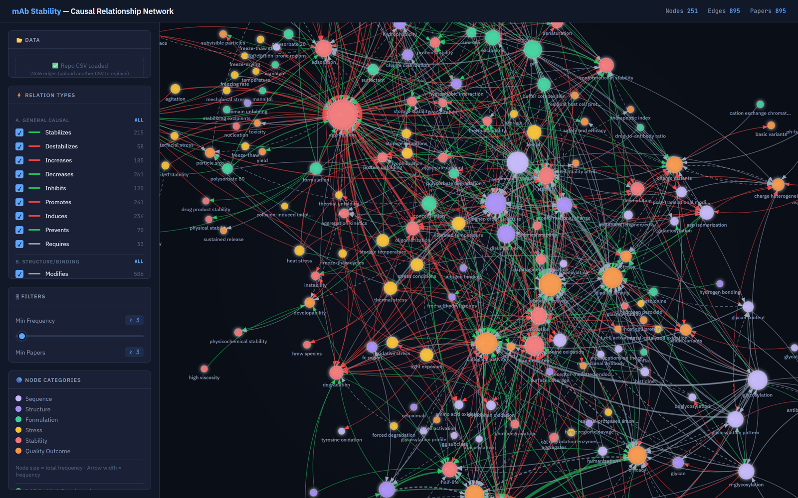
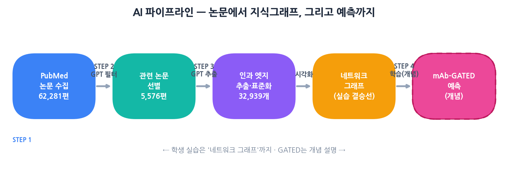

# 🧬 mAb-GATED 교육 패키지
### 생성형 AI로 항체 의약품(mAb) 안정성 지식 그래프를 만들고 예측하기 — 교안 · 쉬운 설명 · 실습

> **40년치** mAb 안정성 논문을 AI가 읽어, **"결정요인 → 안정성 지표 → 임상결과"** 인과 지도(그래프)를 만들고,
> 그 패턴이 학습 가능한지 **mAb-GATED** 모델로 검증하는 연구입니다.
> 이 패키지는 학생이 **직접 그래프를 그리는 데까지** 따라올 수 있게 만든 수업 자료 묶음입니다.

🌐 **라이브 그림책 가이드 → https://starg-lee.github.io/mab-stability-guide/guide/** (Colab 버튼으로 바로 실습!)

원본 연구: STARG-LEE / [mab-causal-network-v2](https://github.com/STARG-LEE/mab-causal-network-v2) · 인터랙티브 그래프: [웹페이지](https://starg-lee.github.io/mab-causal-network-v2/)



### 🧭 이 연구를 한눈에 (Background → Problem → Objective)
- **배경:** IV→SC 전환이 촉발한 40년 연구는 **두 질문**을 쌓았다 — ①*무엇이* 안정성을 좌우하나(결정요인: pH·부형제·서열·구조·스트레스), ②안정성은 *무엇을* 좌우하나(결과: 효능·면역원성·약동학·제조성). 이 둘이 `결정요인 → 안정성 → 결과` 사슬을 이룬다.
- **문제:** 개별 연구는 고립적이고, **가설+검증된 관계를 종합한 전체 네트워크가 없다.** "어떤 주장이 반복 지지되나·가설인가·공백인가"를 물을 틀도, "학습 가능한가"를 검증한 모델도 없었다.
- **목표:** ① 생성형 AI로 채굴 → ② **34개 표준 안정성 지표** 중심의 인과 지식그래프 → ③ **mAb-GATED** 로 학습 가능성 검증(빈도·DistMult 대비).

---

## 📦 이 패키지로 무엇을 할 수 있나요?

- **강사**: 그대로 3차시 수업을 진행할 수 있는 **상세 교안 + 평가 루브릭 + 토론거리**
- **학생**: 배경지식 없이 읽는 **쉬운 설명** + **따라 하면 그래프가 나오는 실습 노트북 2종**
- **공통**: 실제 공개 데이터(2,436 엣지)로 **검증된 예시 그래프 4종**(PNG) 포함

> 🎯 **범위:** 설명은 GATED 모델까지, **실습은 그래프 그리기까지.** (GATED 학습은 개념으로만 — GPU·DB가 필요해 수업 실습엔 부적합)

---

## 🗂️ 폴더 구성

```
mab_teaching_package/
├── README.md                     ← (지금 이 파일) 시작점
├── 01_교안_강사용.md              ← 강사용 상세 교안 (3차시 구성·평가·FAQ·부록)
├── 02_쉬운설명_학생용.md          ← 비전공자도 읽는 친절한 개념 설명
├── 03_실습_가이드.md              ← 노트북 실행 방법·문제해결
├── 04_웹가이드_배포방법.md         ← 그림책을 GitHub Pages로 올리는 방법
├── guide/                        ← 🌐 웹 '그림책' 가이드 (참고 사이트 형식)
│   ├── index.html                   학생용 단일 페이지 안내서(Colab 버튼 포함)
│   └── img/                         예시 그래프 4장
├── notebooks/
│   ├── 01_실습_파이프라인.ipynb / 01_pipeline_practice.ipynb   ← 전 과정 실습(한글/영문명)
│   ├── 02_그래프_그리기.ipynb   / 02_draw_graph.ipynb         ← 그래프 4종(API 불필요·추천)
│   └── draw_graph.py             ← 예시 그래프를 만든 파이썬 스크립트
├── data/
│   └── mab_causal_edges_summary.csv   ← 실제 공개 엣지 데이터(2,436개)
└── images/                       ← 검증된 예시 그래프 4종
    ├── 01_relation_distribution.png   (관계 유형 분포)
    ├── 02_top_hubs.png                (허브 노드 Top 15)
    ├── 03_network_backbone.png        (네트워크 백본)
    └── 04_ego_aggregation.png         (aggregation 이웃)
```

> 🌐 **웹으로 배포하고 싶다면:** `guide/` 폴더가 참고하신 사이트 형식의 **그림책 가이드**입니다.
> GitHub에 올리면 학생이 **Colab 버튼**으로 바로 실행 — 방법은 [04_웹가이드_배포방법.md](04_웹가이드_배포방법.md) 참고.
> 영문 파일명 노트북(`*_practice.ipynb`, `*_draw_graph.ipynb`)은 Colab 링크용 사본입니다.

---

## 🚀 추천 학습 순서

| 순서 | 누구 | 파일 | 목적 |
|---|---|---|---|
| 1 | 학생 | [`02_쉬운설명_학생용.md`](02_쉬운설명_학생용.md) | 큰 그림과 동기 이해 (15분 읽기) |
| 2 | 학생 | `notebooks/02_그래프_그리기.ipynb` | 그래프가 어떻게 생겼는지 직접 보기 (API 불필요) |
| 3 | 학생 | `notebooks/01_실습_파이프라인.ipynb` | 그 데이터가 어떻게 만들어지는지 경험 |
| 4 | 학생 | [`03_실습_가이드.md`](03_실습_가이드.md) | 막힐 때 참고 |
| ★ | 강사 | [`01_교안_강사용.md`](01_교안_강사용.md) | 수업 설계·강의 노트·평가 전부 |

---

## ⚡ 빠른 시작 (3분)

1. https://colab.research.google.com 접속 → 로그인
2. **파일 → 노트 업로드** → `notebooks/02_그래프_그리기.ipynb`
3. 셀을 위에서부터 ▶ 차례로 실행 → **그래프 4종이 화면에 출력**됩니다.
4. 더 해보고 싶으면 `01_실습_파이프라인.ipynb` 로 논문 수집부터 직접!

> OpenAI 키가 있으면 `01` 노트북에서 **내 데이터로** 그래프를 만들 수 있고,
> 없으면 자동으로 공개 샘플을 써서 똑같이 그래프까지 완주합니다.

---

## 🔁 파이프라인 한눈에



```
STEP1 수집        STEP2 필터        STEP3 추출/정규화/집계        시각화 + STEP4 예측
PubMed   ──→  62,281편 ──→ 5,576편(9%) ──→ 39,792 관계 → 32,939 엣지 ──→ D3 그래프
(126 쿼리)       (GPT 관련성)    (관련만)       (GPT 삼중항·표준화)              └→ mAb-GATED
```

| Step | 입력 | 처리 | 출력 |
|---|---|---|---|
| 1 | PubMed API | 인과사슬 기반 126쿼리 검색·수집 | 62,281편 초록 |
| 2 | 62,281편 | GPT 관련성 판단(+근거 저장) | 5,576 관련 논문(9%) |
| 3 | 5,576편 | GPT (원인→관계→결과) 추출·표준화·집계 | **32,939 고유 엣지** |
| 🎨 | 엣지표 | 색·크기·방향성으로 시각화 | 네트워크 그래프 ← **실습 결승선** |
| 4 | 엣지표 | 마스킹된 안정성 노드 예측 학습 | mAb-GATED (개념) |

---

## 🎨 시각화 규칙 (배포용 치트시트)

**노드 색 = 6 카테고리** (= 3층 인과사슬: 결정요인 → 안정성 → 결과)

| 결정요인(Determinants) → | | | | 안정성(Stability) | 결과(Outcomes) |
|---|---|---|---|---|---|
| sequence | structure | formulation | stress | stability | quality_outcome |
| 🟪 `#c4b5fd` | 🟣 `#a78bfa` | 🟢 `#34d399` | 🟡 `#fbbf24` | 🔴 `#f87171` | 🟠 `#fb923c` |

> 그래프는 **왼쪽(결정요인) → 가운데(안정성) → 오른쪽(결과)** 로 읽습니다. 빨강(안정성) 노드 기준 **들어오는 화살표=원인(Q1)**, **나가는 화살표=결과(Q2)**.

**화살표 색 = 방향성**

| 🟢 Positive(안정화/억제) | 🔴 Negative(불안정/촉진) | ⚪ Neutral(상관/수식) |
|---|---|---|
| stabilizes, inhibits, prevents, decreases, shields | promotes, induces, increases, destabilizes, oxidizes… | correlates, modifies, binds, requires |

**크기 = 등장 빈도** (자주 나올수록 큰 노드/굵은 선)

---

## 📊 꼭 기억할 핵심 수치

- 수집 **62,281편** → 관련 **5,576편(9.0%)** → 원시 관계 **39,792** → 고유 엣지 **32,939**
- 노드 카테고리 **6**(결정요인 4 + 안정성 1 + 결과 1), 관계 유형 **22**, 표준 안정성 지표 **34**(물리·화학·생물)
- 허브 Top3: **aggregation(응집) · immunogenicity(면역원성) · binding activity(결합능)**
- mAb-GATED: 파라미터 **3.21M**, 테스트 **MRR 0.884 / Hits@1 84.6%**, 화학 안정성 **99%**

---

## 🔗 링크
- 코드·데이터(GitHub): https://github.com/STARG-LEE/mab-causal-network-v2
- 인터랙티브 그래프: https://starg-lee.github.io/mab-causal-network-v2/  *(CSV 업로드 가능!)*
- 전문가 검수 앱: https://github.com/STARG-LEE/mab-review-app

## 🙏 출처
Lee, G. S., Choi, H. G., Park, J. H., Kim, H. Y., & Park, D. K.
*A Generative AI-Extracted Mechanistic Knowledge Graph for mAb Stability: Construction, Analysis, and Prediction with mAb-GATED* (Version 2, GPT-5-mini). CHA University.
원본 논문(`mAb_GATED_v2.docx`) 및 step1~4 노트북 기반으로 제작된 교육용 자료입니다.

---
*이 패키지의 예시 그래프(images/)는 실제 공개 데이터로 직접 렌더링하여 검증했습니다.*
